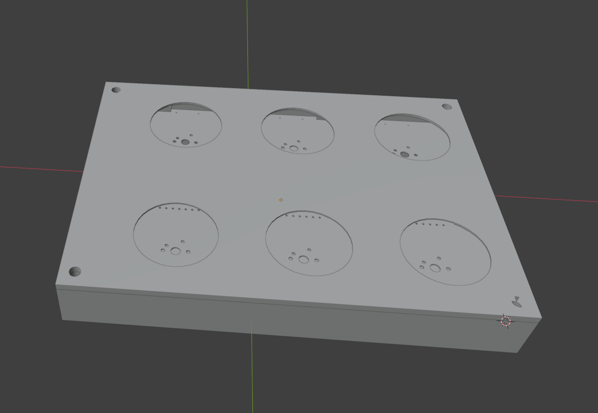
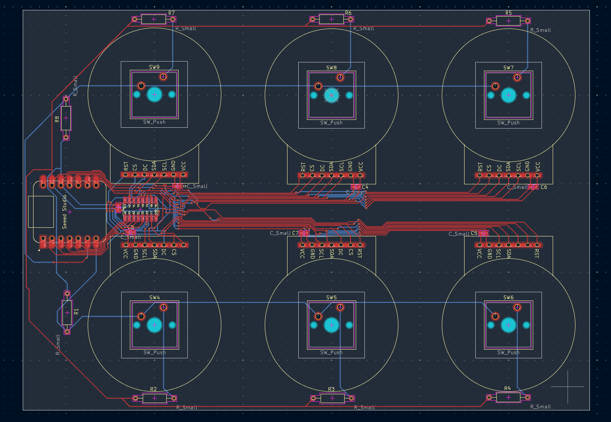

.jpeg)

.jpeg)

## Features

 - 1.28 " TFT Display (no specified number)
 - Customizable Macro Keys
 - Plug And Play USB Communication
 - User-Expandable Actions 

## Cad
The hackpad comes in 3 pieces, the PCB, the top case, and the bottom, the pcb is fastened into the bottom through 5 rectangular blocks that screw into the sides of the bottom section case, the top and bottom are fastened together with 4 screws.

(No current design for the case, if its popular maybe i will do one)

## PCB
Pcb made in kicad

## Firmware + Software
Software is broken down into the macro boards logic and the communication/event handler on the pc side. To get both simply clone this git hub repo, install platformio, and run the upload command for the arduinos logic. While the pc is abit trickier depending on what operating system you use. For Linux mint simply set the deamon/service.py as a startup service, it will simply run in the background searching for the macro board. The deamon is designed to simply run of that single service file, later on if this is popular i will add contribution info and other important stuff to allow others to more deeply control the board.

## BOM

 - 6 Cherry MX Switch
 - 6 1.28" TFT Displays
 -  4 * 4.5mm outer diameter 6mm depth heat inserts
 -  5 * 4.5mm outer diameter 4 mm depth heat inserts
 -  Screws that match (i got hundreds idk the name)
 - 2 sets of 3 differing resistors
 - 74HC138 circuit board
 - Microcontroller of choice 
 - 2 printed parts + 5 rectangular bits

See https://stardance.hackclub.com/projects/10218/devlogs/11779 for a detailed construction of the circuit on a bread board.age](assets/pcbimg.png)
